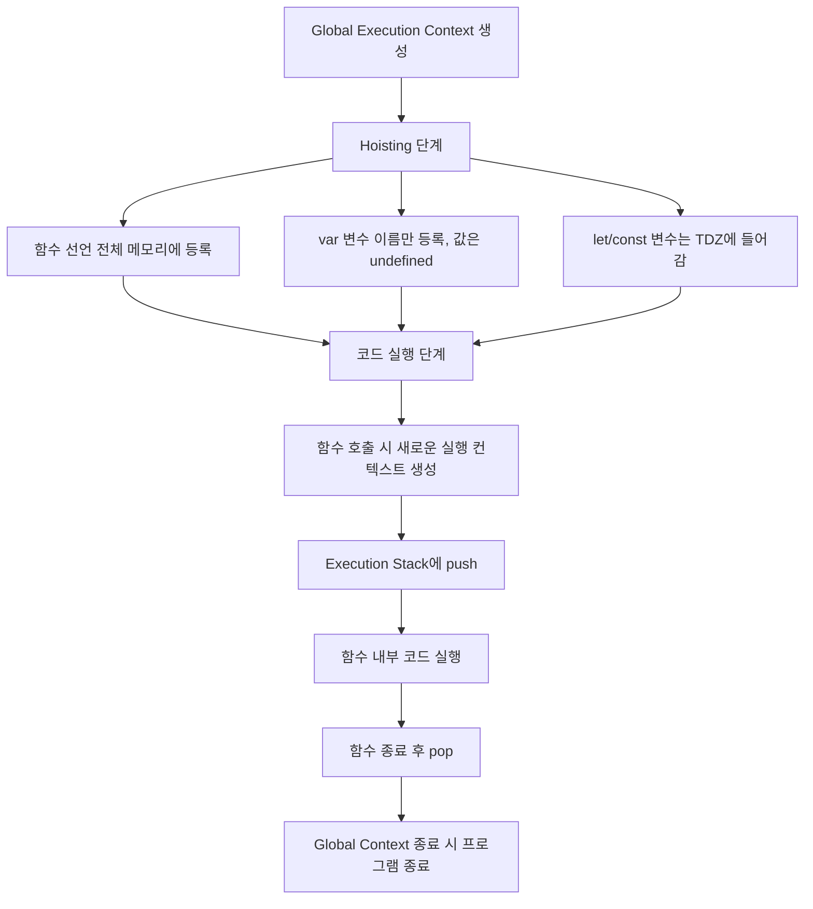

# 🧠 함수 선언 방식 3가지

## 1. ✅ 함수 선언문 (Function Declaration)
```javascript
function a() {
  return 'a';
}
```
- 이름이 있는 함수를 독립적으로 선언.
- 호이스팅됨 → 선언 전에 호출 가능.
- 전역 또는 지역 스코프에 등록됨.
```javascript
console.log(a()); // 'a' → 정상 호출
```


## 2. 🧾 기명 함수 표현식 (Named Function Expression)
```javascript
var b = function bb() {
  return 'b';
};
```

- 변수 b에 **이름이 있는 함수 bb** 를 할당.
- bb()는 `외부에서 호출 불가` → b()로만 호출 가능.
- 호이스팅되지 않음 → 선언 전에 호출하면 오류.
```javascript
console.log(b());  // 'b'
console.log(bb()); // ❌ ReferenceError: bb is not defined
```


## 3. 🕶️ 익명 함수 표현식 (Anonymous Function Expression)
```javascript
var c = function () {
  return 'c';
};
```
- 이름 없는 함수 → 변수 c에 직접 할당.
- c()로만 호출 가능.
- 호이스팅되지 않음 → 선언 전에 호출하면 오류.

```javascript
console.log(c()); // 'c'
```


## 📌 핵심 비교
| 구분                   | 이름 있음 | 변수에 할당 | 호이스팅 | 호출 방식     | 특징                          |
|------------------------|-----------|--------------|----------|----------------|-------------------------------|
| 함수 선언문            | ✅         | ❌           | ✅       | 함수명()       | 선언 전에 호출 가능            |
| 기명 함수 표현식       | ✅         | ✅           | ❌       | 변수명()       | 함수 내부 이름은 외부에서 호출 불가 |
| 익명 함수 표현식       | ❌         | ✅           | ❌       | 변수명()       | 가장 일반적인 표현식 방식       |


## 실행 컨텍스트 흐름도

###  🧠 설명 요약
- Hoisting 단계에서 함수 선언은 전체가 끌어올려지고, var는 이름만 끌어올려짐.
- let과 const는 **TDZ(Temporal Dead Zone)**에 들어가서 초기화 전 접근 불가.
- 함수가 호출되면 새로운 실행 컨텍스트가 생성되어 Execution Stack에 쌓이고, 실행 후 제거됨.


## 💡 요약
- 함수 선언문은 가장 자유롭고 호이스팅되어 선언 전에 호출 가능.
- 기명 함수 표현식은 디버깅에 유리하지만 외부 호출은 변수명으로만 가능.
- 익명 함수 표현식은 가장 많이 쓰이며, 콜백이나 일회성 함수에 자주 사용됨.

---


