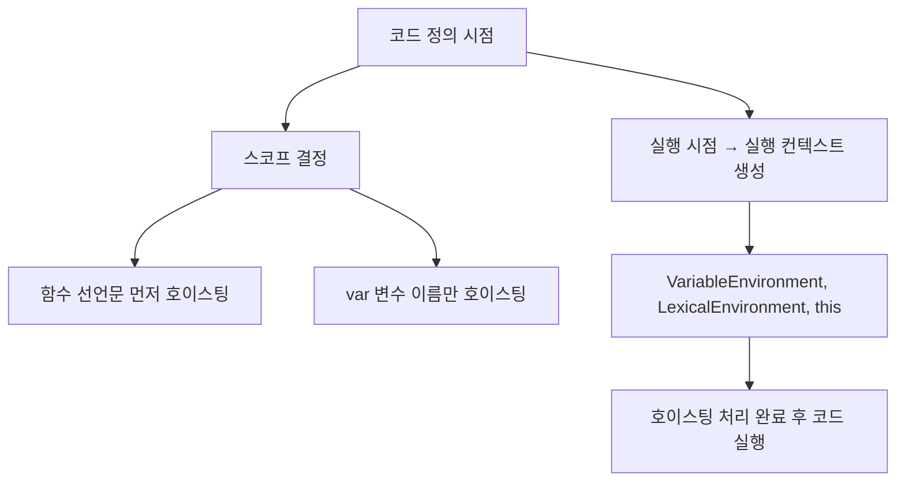
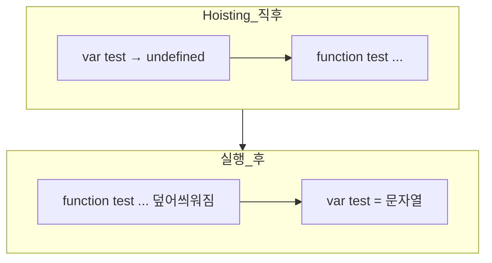

# Scope / Execution Context / Hoisting
지금 내용은 자바스크립트의 스코프(Scope), 실행 컨텍스트(Execution Context), 그리고 **호이스팅(Hoisting)** 의 핵심.  
아래에 전체 흐름과 코드 분석을 정리.

## 🧠 핵심 개념 정리
### 1. 🔍 스코프(Scope)
- 스코프는 코드가 정의될 때 결정됩니다.
- 변수나 함수가 어디에서 선언되었는지에 따라 접근 가능 여부가 결정됩니다.
- 대표적으로 전역 스코프(Global), 함수 스코프(Function), **블록 스코프(Block)** 가 있음.
### 2. ⚙️ 실행 컨텍스트(Execution Context)
- 코드가 실행될 때 생성됩니다.
- 각 실행 컨텍스트는 다음을 포함합니다:
- VariableEnvironment (변수 정보)
- LexicalEnvironment (스코프 정보)
- this 바인딩
- 실행 컨텍스트는 호이스팅, this, 스코프 체인 등을 관리합니다.
### 3. ⬆️ 호이스팅(Hoisting)
- 함수 선언은 변수보다 먼저 호이스팅됩니다.
- 함수 선언은 전체 함수 정의가 끌어올려지고, 변수는 이름만 끌어올려지고 값은 undefined로 초기화됩니다.
- 따라서 함수는 선언 전에 호출 가능, 변수는 선언 전에 접근하면 undefined.

### 📌 코드 분석
```javascript
var scope = 'Global';

function func() {
    var scope = 'Local';

    var literalFunc = function () {
        return scope;
    };
    console.log(literalFunc()); // 'Local'

    var conFunc = new Function("return scope;");
    console.log(conFunc()); // 'Global'
}

func();
```

### 🔍 분석 포인트

| 항목             | 참조되는 스코프       |
|------------------|------------------------|
| `literalFunc`     | `scope = 'Local'`       |
| `new Function()`  | `scope = 'Global'`      |
| `scope` 변수      | `func()` 내부는 `'Local'`, 외부는 `'Global'` |

### 🔥 핵심 차이
- function () { return scope; }는 `정의된 위치의 스코프` 를 캡처함.
- new Function("return scope;")는 `전역 컨텍스트에서 실행` 되므로 내부 스코프를 무시하고 전역을 참조함.

## 📊 흐름 요약 (Mermaid 아스키)

## ✅ 결론 요약
- 함수 선언은 변수보다 먼저 호이스팅됨.
- 스코프는 정의 시점에 결정, 실행 컨텍스트는 실행 시점에 생성됨.
- 실행 컨텍스트는 호이스팅, this, 스코프 체인을 포함함.
- new Function()은 전역 컨텍스트에서 실행되므로 내부 스코프를 무시함.


## 🔍 핵심 질문:
- 같은 이름으로 함수와 변수를 선언하면, 함수가 먼저 호출되는 이유는?
  - 함수 선언이 변수 선언보다 먼저 호이스팅되기 때문입니다.

## 🧠 실행 컨텍스트 초기화 순서
- 자바스크립트는 실행 전에 호이스팅 단계에서 다음 순서로 메모리를 설정합니다:
  - 함수 선언문 전체를 먼저 등록
  - 함수 이름과 본문이 모두 메모리에 올라감
  - 변수 선언(var)은 이름만 등록, 값은 undefined로 초기화
  - 이후 코드 실행 단계에서 값이 할당됨

## 🔄 예제 비교
```javascript
console.log(test()); // ✅ 함수 호출 가능

function test() {
  return '함수입니다';
}

var test = '변수입니다';
console.log(test); // '변수입니다'
```

### 실행 흐름:
- 호이스팅 단계에서 function test()가 먼저 등록됨
- var test는 이름만 등록되고 undefined로 초기화됨
- console.log(test())는 함수로 호출됨
- 이후 test = '변수입니다'가 실행되면서 함수가 덮어씌워짐

## 📌 핵심 요약
| 구분       | 호이스팅 방식             | 초기값       | 호출 가능 시점       | 특징                          |
|------------|---------------------------|--------------|----------------------|-------------------------------|
| function   | 전체 함수 정의가 끌어올려짐 | 함수 자체    | 선언 이전에도 호출 가능 | 마지막 선언이 유효, 덮어쓰기 가능 |
| var        | 변수 이름만 끌어올려짐     | undefined    | 선언 이전엔 오류 발생   | 값은 실행 단계에서 할당됨       |

## 🧠 스코프 vs 실행 컨텍스트

| 구분             | 결정 시점         | 역할/내용                                   | 특징                                   |
|------------------|------------------|-------------------------------------------|----------------------------------------|
| 스코프 (Scope)   | 정의 시점         | 변수와 함수의 **접근 가능 범위** 결정          | 코드 작성 시 이미 결정됨 (Lexical Scope) |
| 실행 컨텍스트    | 실행 시점         | 코드 실행 환경: 변수, 함수, this, 스코프 체인 | 코드 실행 시 생성, 관리됨                |


## 🔥 결론
- 함수와 변수 이름이 같을 경우, 함수가 먼저 호이스팅되므로 초기 호출은 함수로 작동합니다.
- 이후 코드 실행 중에 변수에 값이 할당되면 함수는 덮어씌워짐.
- 스코프는 정의 시점에 결정, 실행 컨텍스트는 실행 시점에 생성되어 호이스팅과 this 바인딩을 처리합니다.


## 🧠 호이스팅 단계의 처리 순서
- 함수 선언문
  - 전체 함수 정의가 메모리에 먼저 등록됩니다.
  - 즉, 이름과 본문까지 모두 올라가서 바로 호출 가능 상태가 됩니다.
- 변수 선언 (var)
  - 이름만 등록되고 값은 undefined로 초기화됩니다.
  - 이때 함수와 같은 이름의 변수가 있더라도, 호이스팅 단계에서는 함수가 우선 적용됩니다.

## 🔄 실행 단계에서의 변화
- 코드 실행이 시작되면 var test = "값"; 같은 할당문이 실행됩니다.
- 이때 변수가 함수 값을 덮어씌우게 됩니다.
- 따라서 최종적으로는 변수에 들어간 값이 남습니다.

## 📌 예제
```javascript
var test = "문자열";

function test() {
  return "함수";
}

console.log(test); // "문자열"
```

## 실행 흐름
- 호이스팅 직후: test는 함수로 등록됨
- 실행 중: var test = "문자열"; 실행 → 함수가 덮어씌워짐
- 출력: "문자열"

## ✅ 결론
- 호이스팅 단계에서는 함수가 먼저 등록되므로 변수를 덮어쓰지 않는다.
- 하지만 실행 단계에서 변수에 값이 할당되면 함수가 덮어씌워진다.
- 따라서 console.log(test) 시점에는 변수 값이 출력된다.

## 메모리 스냅샵



---


