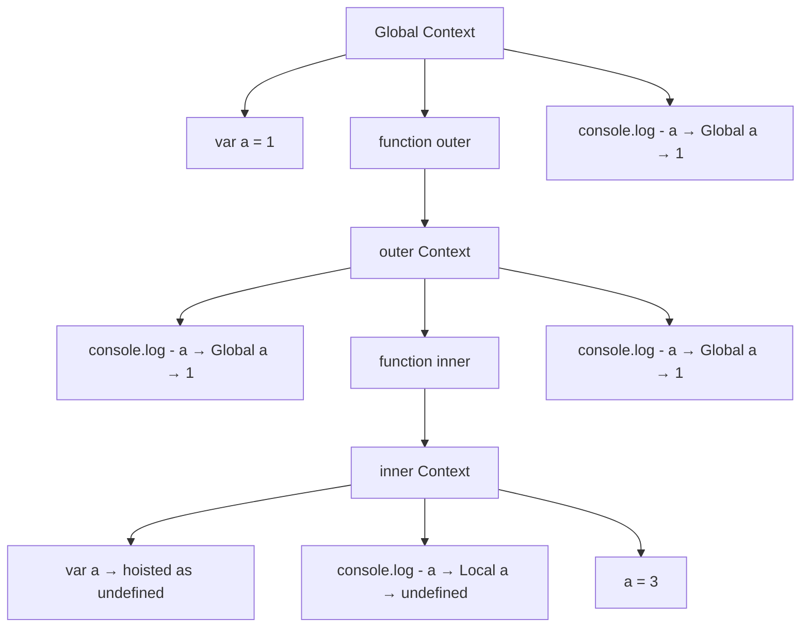

# 스코프 체인 / 실행 컨텍스트 / 호이스팅
자바스크립트의 스코프 체인, 실행 컨텍스트, 그리고 호이스팅이 어떻게 작동하는지를 완벽하게 보여주는 예제. 

## 🧠 코드 전체 흐름
```javascript
var a = 1;

function outer() {
  console.log(a); // 1

  function inner() {
    console.log(a); // undefined
    var a = 3;
  }

  inner();
  console.log(a); // 1
}

outer();
console.log(a); // 1
```


## 🔍 실행 흐름 요약
### 출력 순서:
```
1 → undefined → 1 → 1
```

## 🧩 단계별 분석
### ✅ 1. 전역 컨텍스트 생성
- var a = 1 → 전역 변수 a에 1 저장
- outer() 함수 선언됨
### ✅ 2. outer() 실행 → outer 실행 컨텍스트 생성
- console.log(a)
  - a는 outer 내부에 없으므로 스코프 체인을 따라 전역에서 탐색
  - 출력: 1
### ✅ 3. inner() 실행 → inner 실행 컨텍스트 생성
- console.log(a)
  - inner 내부에 var a가 있으므로 호이스팅됨
  - 이때 a는 선언만 끌어올려지고 값은 undefined
  - 출력: undefined
- var a = 3 실행 → 이제 a는 3이 됨
### ✅ 4. console.log(a) in outer
- outer 내부에 a 없음 → 전역 a 참조 → 출력: 1
### ✅ 5. console.log(a) in global
- 전역 a는 여전히 1 → 출력: 1

## 📌 핵심 개념 정리
### 🔄 호이스팅
- var a = 3은 inner() 내부에서 호이스팅되어 a가 먼저 선언되고 undefined로 초기화됨
- 그래서 console.log(a)는 undefined 출력
#### 🔗 스코프 체인
- 자바스크립트는 Lexical Scope 기반
- 함수가 정의된 위치에 따라 상위 스코프를 결정함
- outer()는 전역을, inner()는 outer()를 상위 스코프로 가짐
#### ⚙️ 실행 컨텍스트
- 각 함수 호출 시마다 새로운 실행 컨텍스트가 생성되고  
  그 안에 VariableEnvironment, LexicalEnvironment, this, ScopeChain이 포함됨

### 🧠 시각적 요약 (Mermaid)


## Context 이미지


## ✅ 결론 요약

| 위치        | 변수명 | 출력값     | 설명                        |
|-------------|--------|------------|-----------------------------|
| outer()     | a      | 1          | outer 내부에 없어서 전역 a 참조 |
| inner()     | a      | undefined  | var a 호이스팅 → 초기값 undefined |
| outer()     | a      | 1          | 여전히 전역 a 참조             |
| global      | a      | 1          | 전역 변수 a 그대로 유지        |

- 이 코드는 호이스팅 + 스코프 체인 + 실행 컨텍스트를 동시에 보여주는 완벽한 예제입니다.

