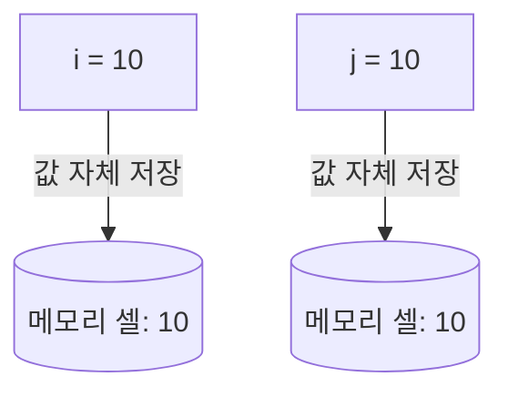
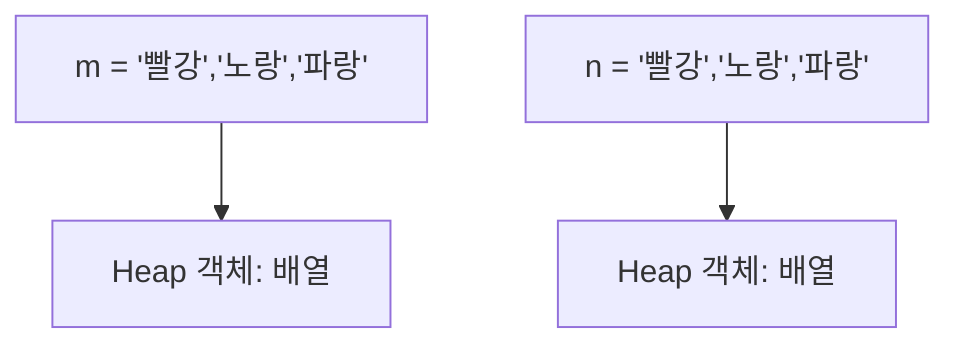
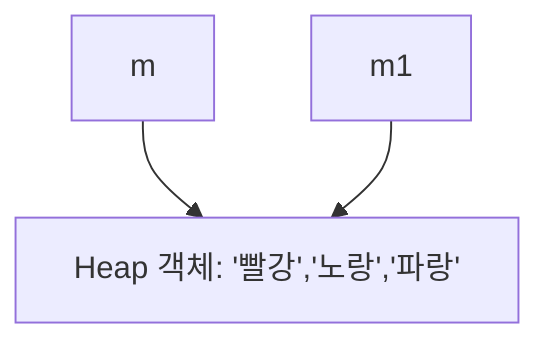

# primitive / reference

아래는 JavaScript에서 primitive(원시값)과 reference(참조값) 변수의 차이를 예제와 함께 정리한 문서입니다.

## 📘 Primitive vs Reference 변수 이해하기
### ✅ Primitive (원시값)
```javascript
var i = 10;
var j = 10;

console.log(i == j);   // true
console.log(i === j);  // true
```

- 원시값: `number`, `string`, `boolean`, `null`, `undefined`, `symbol`, `bigint`
- 값 자체가 변수에 저장됨
- 같은 값이면 == / === 모두 true
- 복사 시 값 자체가 복사됨 → 독립적
```javascript
var i = 10;
var j = i;
console.log(j); // 10
```


### ✅ Reference (참조값)
```javascript
var m = ['빨강', '노랑', '파랑'];
var n = ['빨강', '노랑', '파랑'];

console.log(m == n);   // false
console.log(m === n);  // false
```
- 참조값: `object`, `array`, `function`, `date`, `regexp` 등
- 변수에는 값이 아니라 **메모리 주소(참조)** 가 저장됨
- 배열/객체가 같아 보여도 서로 다른 메모리 주소 → ==, === 모두 false

### ✅ 참조 복사
```javascript
var m1 = m;        // 같은 참조를 공유
m1[2] = '녹색';    // m1을 수정하면 m도 같이 바뀜

console.log(m);    // [ '빨강', '노랑', '녹색' ]
```

- m1 = m은 배열을 새로 복사하는 것이 아니라 같은 참조를 가리킴
- 따라서 하나를 수정하면 다른 변수에서도 변경된 값이 보임

## 📊 요약표 (Markdown ASCII)
| 구분        | 저장 방식            | 비교 결과             | 복사 시 동작                  |
|-------------|----------------------|-----------------------|-------------------------------|
| Primitive   | 값 자체 저장         | 값이 같으면 true      | 값 자체가 복사됨 (독립적)     |
| Reference   | 메모리 주소(참조) 저장 | 참조가 같아야 true    | 참조 공유 (같은 객체를 가리킴) |

## ✅ 핵심 포인트
- 원시값은 값 자체를 저장 → 독립적
- 참조값은 메모리 주소를 저장 → 공유됨
- 배열/객체 비교 시 ==/===는 참조 비교이므로 false
- 참조 복사 시 같은 객체를 가리키므로 변경이 공유됨

## 📘 Primitive 변수 메모리 상태


- i와 j는 각각 독립된 메모리 셀에 값 10을 저장
- 값이 같아도 서로 다른 메모리 위치 → 독립적

## 📘 Reference 변수 메모리 상태


- m과 n은 서로 다른 배열 객체를 참조
- 배열 내용이 같아도 참조 주소가 다르므로 m == n → false

## 📘 Reference 복사 (얕은 복사)


- m1 = m은 새로운 배열을 만드는 것이 아니라 같은 Heap 객체를 참조
- 따라서 m1[2] = '녹색'을 하면 m도 함께 변경됨

## ✅ 요약
- Primitive: 값 자체가 메모리에 저장 → 독립적
- Reference: 메모리 주소(참조)가 저장 → 같은 객체를 공유할 수 있음
- 복사 시 Primitive는 값 복사, Reference는 주소 복사

---
# Statck / Heap
JavaScript에서 흔히 **primitive는 stack에 저장되고, reference는 heap에 저장된다** 라는 설명을 많이 접하셨을 것임.  
하지만 실제로는 조금 더 미묘합니다.

## 📘 JavaScript 메모리 모델
### ✅ Primitive (원시값)
- number, string, boolean, null, undefined, symbol, bigint
- 값 자체가 변수에 저장됨
- 엔진 내부 구현에 따라 stack 또는 레지스터에 직접 저장될 수 있음
- 크기가 작고 불변(immutable)이므로 복사 시 값 자체가 전달됨
```javascript
let a = 10;
let b = a;   // 값 자체 복사
```
- a와 b는 서로 독립적인 메모리 셀에 10을 저장

### ✅ Reference (참조값)
- object, array, function, date, regexp 등
- 변수에는 **객체의 참조(메모리 주소)** 가 저장됨
- 실제 데이터는 heap 영역에 저장
- 복사 시 참조 주소만 복사 → 같은 객체를 공유
```javascript
let arr1 = [1, 2, 3];
let arr2 = arr1;   // 참조 복사
arr2[0] = 99;
console.log(arr1); // [99, 2, 3]
```
- arr1과 arr2는 같은 heap 객체를 가리킴

### ⚠️ 주의할 점
- **JavaScript 명세(ECMAScript)** 는 **stack** 과 **heap** 같은 저수준 메모리 구조를 직접 정의하지 않습니다.
- **primitive는 stack, reference는 heap** 이라는 설명은 개념적 비유이지, 엔진마다 실제 구현은 다를 수 있습니다.
- 예: V8 엔진은 작은 문자열이나 숫자를 최적화해서 `레지스터`/`stack`에 둘 수도 있고, 큰 값은 heap에 둘 수도 있습니다.

## 📊 요약 (Markdown ASCII)
| 구분        | 저장 방식                  | 복사 시 동작                  |
|-------------|----------------------------|-------------------------------|
| Primitive   | 값 자체 (stack/레지스터)   | 값 자체 복사 (독립적)         |
| Reference   | 참조 주소 (stack) → heap   | 참조 공유 (같은 객체 가리킴)  |

## ✅ 결론:
- 개념적으로 primitive는 stack에 저장된다고 설명하지만, 실제 엔진 구현은 최적화에 따라 다릅니다.
- 중요한 건 primitive는 값 자체를 복사, reference는 주소를 복사한다는 차이입니다.

---


