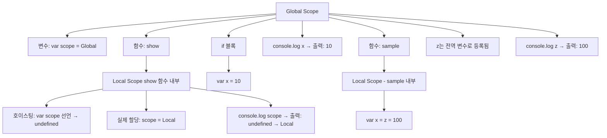

# Hoisting / this
아래는 당신이 정리한 코드와 개념을 기반으로 한 JavaScript의 블록 스코프, 호이스팅, this 바인딩에 대한 핵심 문서입니다.  
그림 속 코드도 반영해서 설명을 덧붙였습니다.

## 📘 JavaScript 스코프, 호이스팅, this 바인딩 정리
### ✅ 1. 함수만 블록 스코프를 가진다
```javascript
var scope = 'Global';
function show() {
    var scope = 'Local';
    return scope;
}
console.log(show()); // "Local"
console.log(scope);  // "Global"
```

- var는 함수 스코프만 가짐
- 함수 내부에서 선언된 scope는 외부와 별개
- 함수 외의 {} (예: if, for)에서는 블록 스코프가 적용되지 않음
```javascript
if (true) {
    var x = 10;
}
console.log(x); // 10 (if 블록 밖에서도 접근 가능)
```


### ✅ 2. 암묵적 전역 변수와 참조 주의
```javascript
function sample() {
    var x = z = 100;
}
sample();
console.log(z); // 100 (전역 변수로 등록됨)
```
- z = 100은 var 없이 선언 → 전역 객체에 등록됨
- x는 지역 변수, z는 전역 변수
- 항상 명시적으로 선언할 것

### ✅ 3. 호이스팅(Hoisting) 주의
```javascript
var scope = 'Global';
function show() {
    console.log(scope); // undefined
    var scope = 'Local';
    return scope;
}
console.log(show()); // "Local"
console.log(scope);  // "Global"
```

- var scope는 함수 내부에서 호이스팅되어 undefined로 초기화됨
- 선언은 끌어올려지지만 초기화는 원래 위치에서 수행됨

### ✅ 4. this 바인딩은 호출 방식에 따라 달라진다

```javascript
this.data1 = 100;

(function () {
    var data = 108;
    console.log(data);         // 108
    console.log(this.data1);   // 100 (call(this)로 this 바인딩됨)
}).call(this);

console.log(data); // undefined (data는 지역 변수)
```

- call(this)를 사용하면 this가 외부 컨텍스트를 가리킴
- 즉시 실행 함수에서도 this를 명시적으로 바인딩할 수 있음

### ✅ 5. this는 호출 컨텍스트에 따라 달라진다
```javascript
this.data = 100;

var window = (function () {
    return this;
}());
console.log(window.data); // undefined (this는 global이 아님)

var window = (function () {
    return this;
}.call(this));
console.log(window.data); // 100 (this가 외부 컨텍스트를 가리킴)
```

- this는 함수 호출 방식에 따라 동적으로 결정됨
- call, apply, bind를 사용하면 명시적으로 바인딩 가능
- 일반 함수 호출에서는 this는 undefined 또는 global (strict mode 여부에 따라 다름)

## 📊 핵심 요약표 (Markdown ASCII)
| 개념        | 설명                                                   | 주의사항                          |
|-------------|--------------------------------------------------------|-----------------------------------|
| 함수 스코프 | `var`는 함수 내부에서만 블록 스코프 적용              | if/for 블록은 스코프 아님         |
| 호이스팅    | 선언은 끌어올려지지만 초기화는 원래 위치에서 수행됨   | 초기값은 undefined로 설정됨       |
| 암묵적 전역 | 선언 없이 할당된 변수는 전역 객체에 등록됨            | `var`, `let`, `const` 꼭 사용     |
| this 바인딩 | 호출 방식에 따라 `this`가 달라짐                      | `call`, `apply`, `bind`로 제어 가능 |


---

# 이미지 설명
 👍
아래는 이미지 속 코드에 대한 상세 설명입니다. 이 코드는 전역 객체, 변수 호이스팅, 함수 스코프를 다루고 있음.

## 📘 코드 분석
### 🔹 GLOBAL 5
```javascript
var window = (function () {
    return this;
}());
```

- 이 코드는 즉시 실행 함수(IIFE)를 통해 this를 반환하고, 그 값을 window 변수에 저장합니다.
- 하지만 var window = ...으로 선언했기 때문에, 전역 객체의 window를 덮어쓰게 됩니다.
- 결과적으로 window는 원래의 전역 객체가 아니라 함수에서 반환된 this가 됩니다.
- 이 this는 전역 컨텍스트에서 실행되었기 때문에 전역 객체를 가리킵니다.

### 🔹 GLOBAL 6
```javascript
myname = "global"; // 선언 없이 할당 → 전역 변수
function func() {
    console.log(myname); // undefined
    var myname = "local";
    console.log(myname); // "local"
}
func();
```

🔍 동작 설명
- myname = "global"은 var, let, const 없이 선언 → 전역 객체에 등록됨
- func() 내부에서 var myname이 선언되었기 때문에, 호이스팅이 발생합니다:

```javascript
function func() { 
    var myname; // 호이스팅된 선언 
    console.log(myname); // 아직 초기화되지 않음 → undefined 
    myname = "local"; 
    console.log(myname);     // "local" 
}
```
- 즉, `var myname`이 함수 시작 시점에 선언되지만 초기화는 아래에서 이뤄지므로  
    첫 번째 `console.log(myname)`은 `undefined`가 출력됩니다.

---

## 🧠 핵심 개념 요약

| 개념         | 설명                                                                 |
|--------------|----------------------------------------------------------------------|
| 전역 객체    | 브라우저에서는 `window`, Node.js에서는 `global`                     |
| 암묵적 전역  | `var` 없이 선언된 변수는 전역 객체에 등록됨                         |
| 호이스팅     | `var`로 선언된 변수는 함수/스코프 최상단으로 끌어올려지며 초기값은 `undefined` |
| 함수 스코프  | `var`는 함수 내부에서만 유효하며 블록(if, for 등)에는 적용되지 않음 |

---


## 📘 JavaScript 호이스팅과 스코프 (Mermaid)


## ✅ 설명 요약
- var는 함수 스코프만 가짐 → if, for 블록은 스코프로 인식되지 않음
- var로 선언된 변수는 호이스팅되어 함수 최상단에서 undefined로 초기화됨
- 선언 없이 할당된 변수(z = 100)는 전역 객체에 등록됨
- 함수 내부에서 var scope = "Local"을 선언하면, console.log(scope)는 먼저 undefined를 출력하고 이후 "Local"로 할당됨
